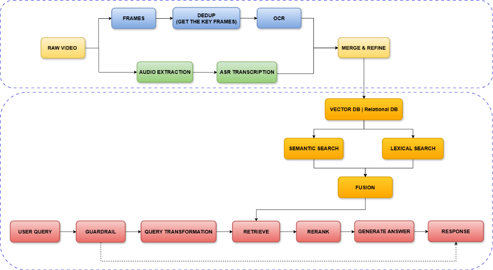
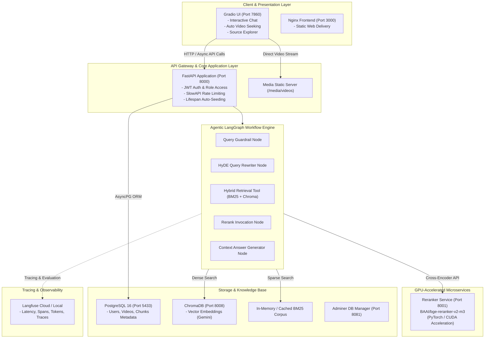
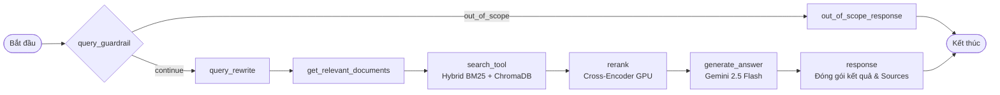

<div align="center">
<p align="center">
  <a href="https://www.uit.edu.vn/" title="University of Information Technology">
    
  </a>
</p>

# A Temporal RAG Framework for UIT Course Video Retrieval & Q&A

### Đồ án môn học CS431 - Các Kỹ thuật Học sâu và Ứng dụng

---

[](https://github.com/NBasLongz/A-Temporal-RAG-Framework-for-UIT-Course-Video-Retrieval.git)
[](https://www.python.org/)
[](https://fastapi.tiangolo.com/)
[](https://langchain-ai.github.io/langgraph/)
[](https://www.trychroma.com/)
[](https://pytorch.org/)
[](https://gradio.app/)
[](https://www.docker.com/)
[](https://langfuse.com/)

**GitHub Repository:** [https://github.com/NBasLongz/A-Temporal-RAG-Framework-for-UIT-Course-Video-Retrieval.git](https://github.com/NBasLongz/A-Temporal-RAG-Framework-for-UIT-Course-Video-Retrieval.git)

</div>

---

## Danh sách thành viên nhóm

| STT | Họ và Tên | MSSV | GitHub |
| :---: | :--- | :---: | :--- |
| **1** | **Lương Quang Duy** | `23520368` | [duylw](https://github.com/duylw) |
| **2** | **Nguyễn Bá Long** | `23520880` | [NBasLongz](https://github.com/NBasLongz) |
| **3** | **Dương Thái Ý Nhi** | `23521106` | [dtynhi](https://github.com/dtynhi) |

---

## Mục lục
- [Giới thiệu tổng quan](#giới-thiệu-tổng-quan)
- [Quy trình xử lý toàn diện (End-to-End Pipeline)](#quy-trình-xử-lý-toàn-diện-end-to-end-pipeline)
- [Kiến trúc hệ thống và Dịch vụ (System Architecture)](#kiến-trúc-hệ-thống-và-dịch-vụ-system-architecture)
- [Hiện thực hóa Agentic RAG với LangGraph (LangGraph Implementation)](#hiện-thực-hóa-agentic-rag-với-langgraph-langgraph-implementation)
- [Các tính năng chính](#các-tính-năng-chính)
- [Cấu trúc mã nguồn](#cấu-trúc-mã-nguồn)
- [Yêu cầu hệ thống](#yêu-cầu-hệ-thống)
- [Cài đặt và Khởi chạy](#cài-đặt-và-khởi-chạy)
- [Cấu hình biến môi trường (.env)](#cấu-hình-biến-môi-trường-env)
- [Tài liệu API Endpoints](#tài-liệu-api-endpoints)
- [Giao diện người dùng (Gradio UI)](#giao-diện-người-dùng-gradio-ui)
- [Giám sát và Đánh giá (Observability)](#giám-sát-và-đánh-giá-observability)
- [Thông tin môn học](#thông-tin-môn-học)

---

## Giới thiệu tổng quan

Trong các khóa học trực tuyến và đại học hiện đại, bài giảng video là nguồn tri thức phong phú nhưng đòi hỏi nhiều thời gian để tra cứu chính xác phân đoạn cần xem lại. Việc tua thủ công các video dài để tìm kiếm một định nghĩa, công thức toán hay giải thích thuật toán làm giảm hiệu suất tự học của sinh viên.

**A Temporal RAG Framework for UIT Course Video Retrieval** là hệ thống Hỏi - Đáp (Q&A) dựa trên kiến trúc RAG (Retrieval-Augmented Generation) kết hợp điều phối đồ thị tác vụ tự động (**LangGraph**) và cơ chế định vị mốc thời gian (**Temporal Video Retrieval**).

Hệ thống cung cấp các khả năng:
1. Tiếp nhận câu hỏi học thuật tự nhiên bằng tiếng Việt từ người học.
2. Kiểm duyệt an toàn câu hỏi và áp dụng kỹ thuật **HyDE** (Hypothetical Document Embeddings) để mở rộng ngữ nghĩa truy vấn bài giảng.
3. Thực hiện truy xuất kết hợp **Hybrid Search (BM25 + ChromaDB Dense Embedding)**.
4. Tái xếp hạng ngữ nghĩa chuyên sâu bằng Microservice Cross-Encoder **BAAI/bge-reranker-v2-m3** (tăng tốc GPU).
5. Sinh câu trả lời sư phạm chi tiết kèm công thức toán $\LaTeX$ và liên kết mốc thời gian (**Timestamp**), hỗ trợ **chuyển thẳng tới phân đoạn video bài giảng tương ứng**.

---

## Quy trình xử lý toàn diện (End-to-End Pipeline)

Dưới đây là sơ đồ kiến trúc quy trình tổng thể từ khâu nạp và tiền xử lý video bài giảng (Offline Ingestion) đến khâu tiếp nhận câu hỏi và sinh phản hồi thông minh (Online Inference):

<div align="center">
  
</div>

Quy trình được chia thành 2 giai đoạn độc lập nhưng liên kết chặt chẽ:

### 1. Giai đoạn Tiền xử lý & Nạp dữ liệu (Offline Ingestion)
- **Xử lý hình ảnh (Visual Stream)**:
  - Phân tách video gốc (`RAW VIDEO`) thành chuỗi khung hình (`FRAMES`).
  - Lọc bỏ khung hình trùng lặp để trích xuất các khung hình chính mang thông tin (`DEDUP / GET THE KEY FRAMES`).
  - Sử dụng mô hình `OCR` để nhận diện toàn bộ văn bản và công thức xuất hiện trên slide bài giảng.
- **Xử lý âm thanh (Audio Stream)**:
  - Tách luồng âm thanh từ video (`AUDIO EXTRACTION`).
  - Sử dụng mô hình nhận dạng tiếng nói tự động (`ASR TRANSCRIPTION`) để chuyển đổi lời giảng thành văn bản đồng bộ theo mốc thời gian.
- **Hợp nhất và lưu trữ (Merge & Refine)**:
  - Ghép nối thông tin hình ảnh (slide) và âm thanh (lời giảng), phân đoạn thành các chunks văn bản logic.
  - Lưu trữ metadata và quan hệ thời gian vào cơ sở dữ liệu quan hệ (`Relational DB - PostgreSQL`), đồng thời tính toán vector đại diện để lập chỉ mục trong cơ sở dữ liệu vector (`VECTOR DB - ChromaDB`).

### 2. Giai đoạn Truy xuất & Sinh câu trả lời (Online Inference)
- **Kiểm duyệt an toàn (`GUARDRAIL`)**: Tiếp nhận câu hỏi của sinh viên (`USER QUERY`), phát hiện các truy vấn độc hại hoặc ngoài phạm vi khóa học. Nếu không hợp lệ, hệ thống phản hồi từ chối ngay (`RESPONSE`).
- **Biến đổi truy vấn (`QUERY TRANSFORMATION`)**: Sử dụng phương pháp HyDE mở rộng ngữ cảnh câu hỏi sang tiếng Việt học thuật kèm thuật ngữ tiếng Anh.
- **Truy xuất kết hợp (`RETRIEVE & FUSION`)**: Thực hiện đồng thời tìm kiếm ngữ nghĩa sâu (`SEMANTIC SEARCH`) trên Vector DB và tìm kiếm từ khóa chính xác (`LEXICAL SEARCH` qua BM25), sau đó kết hợp điểm số qua cơ chế `FUSION`.
- **Tái xếp hạng (`RERANK`)**: Đưa danh sách tài liệu ứng viên qua mô hình Cross-Encoder chuyên biệt để chấm điểm tương đồng ngữ nghĩa chính xác nhất.
- **Sinh câu trả lời (`GENERATE ANSWER`)**: Mô hình LLM tổng hợp ngữ cảnh đã qua lọc và sinh câu trả lời chi tiết kèm danh sách mốc thời gian video để trả về cho người dùng (`RESPONSE`).

---

## Kiến trúc hệ thống và Dịch vụ (System Architecture)

Hệ thống được phân chia theo kiến trúc Microservices và đóng gói hoàn chỉnh bằng **Docker Compose**:



---

## Hiện thực hóa Agentic RAG với LangGraph (LangGraph Implementation)

Pipeline xử lý truy vấn trực tuyến được hiện thực hóa dưới dạng đồ thị có trạng thái (**StateGraph**) trong module [`src/services/rag/agent_graph.py`](file:///f:/University%20of%20information%20technology%27s%20Courses/CS431_DL/Project_RAG/temporal-rag-chatbot/src/services/rag/agent_graph.py), đảm bảo tính module hóa và dễ mở rộng:



### 1. Quản lý trạng thái đồ thị (`ThreadState`)
Trạng thái luồng xử lý được duy trì nhất quán qua các node với schema `ThreadState`:
- `messages`: Danh sách chuỗi hội thoại (`HumanMessage`, `AIMessage`, `ToolMessage`).
- `original_query` & `rewritten_query`: Lưu vết câu hỏi gốc và tài liệu giả định được sinh bởi node `query_rewrite`.
- `guardrail_result`: Kết quả đánh giá mức độ an toàn và độ liên quan học thuật từ node `query_guardrail`.
- `sources`: Danh sách chunks bài giảng (kèm `video_id`, `timestamp`, `duration`) sau khi qua bước lọc và reranking.
- `n_iterations` & `n_llm_calls`: Bộ đếm vòng lặp và số lần gọi LLM để kiểm soát giới hạn tài nguyên.

### 2. Ngữ cảnh thực thi động (`Runtime Context`)
Các tham số suy luận được truyền độc lập qua lớp `Context`, cho phép thay đổi cấu hình linh hoạt theo từng request mà không cần tái khởi tạo đồ thị:
- `retriever_top_k` (mặc định 20): Số lượng ứng viên thu thập ban đầu từ Hybrid Search.
- `reranker_top_k` (mặc định 10): Số lượng ứng viên tối ưu nhất giữ lại sau bước Cross-Encoder.
- `temperature`, `llm_model`, `reranker_url`: Các cấu hình kết nối mô hình và dịch vụ suy luận.

### 3. Cơ chế rẽ nhánh có điều kiện (Conditional Routing)
- **`continue_after_guardrail`**: Định tuyến dựa trên kết quả kiểm duyệt an toàn. Nếu truy vấn vi phạm hoặc nằm ngoài phạm vi học thuật, luồng xử lý rẽ sang `out_of_scope_response` và kết thúc ngay, tiết kiệm chi phí gọi mô hình tìm kiếm và sinh văn bản.
- **`tools_condition`**: Kích hoạt `ToolNode` thực thi công cụ tìm kiếm kết hợp song song (Sparse BM25 + Dense ChromaDB) trước khi chuyển tiếp sang tầng tái xếp hạng Cross-Encoder GPU.

---

## Các tính năng chính

- **Temporal Video Grounding**: Mỗi đoạn transcript được liên kết với `video_id`, `timestamp` (thời điểm bắt đầu tính theo giây) và `duration`. Giao diện hỗ trợ chuyển trực tiếp đến đúng thời điểm phát của video khi nhấp vào nguồn trích dẫn.
- **Kiểm duyệt học thuật và bảo mật**: Nhận diện các truy vấn ngoài phạm vi môn học và ngăn chặn tấn công injection trước khi chuyển dữ liệu vào quy trình sinh câu trả lời.
- **Microservice Reranker chuyên biệt**: Đóng gói mô hình Cross-Encoder riêng biệt, tối ưu hóa tính toán trên GPU thông qua PyTorch/CUDA.
- **Hybrid Search tối ưu hóa tiếng Việt**: Kết hợp tìm kiếm vector ngữ nghĩa với tìm kiếm từ khóa chính xác BM25 cho thuật ngữ chuyên ngành.
- **Quản lý xác thực và phân quyền**: Tích hợp JWT Authentication, phân quyền người dùng và kiểm soát tần suất truy cập với **SlowAPI Rate Limiter**.
- **Quan sát hệ thống (Observability)**: Tích hợp **Langfuse** để theo dõi vết thực thi (traces), phân rã độ trễ từng bước và giám sát mức độ sử dụng token.
- **Hot-reload với Docker Compose Watch**: Đồng bộ thay đổi mã nguồn lập tức vào container đang chạy mà không cần build lại toàn bộ image.

---

## Cấu trúc mã nguồn

```bash
temporal-rag-chatbot/
├── .env.example               # Mẫu cấu hình biến môi trường
├── compose.yaml               # Docker Compose cấu hình 6 services (Backend, UI, DB, Chroma, Reranker, Adminer)
├── Dockerfile                 # Dockerfile cho Backend FastAPI
├── Dockerfile.gradio          # Dockerfile cho Gradio Web Client
├── pyproject.toml             # Quản lý dependencies với uv
├── main.py                    # Entry point khởi tạo FastAPI app & Lifespan Seeding
├── gradio_app.py              # Entry point chạy Gradio Interface
│
├── data/                      # Dữ liệu phục vụ bài giảng và RAG
│   ├── videos/                # Thư mục chứa các tệp video MP4 bài giảng
│   ├── videos.csv             # Danh mục video và URL mapping
│   ├── chunks.csv             # Dữ liệu chunk văn bản & timestamp
│   ├── video_chunks.csv       # Metadata chi tiết các phân đoạn video
│   └── vector_data_export.pkl # Dữ liệu vector trích xuất sẵn
│
├── inference/                 # Microservice Reranker chuyên biệt
│   ├── Dockerfile             # Container inference tối ưu PyTorch + CUDA
│   ├── main.py                # FastAPI endpoint /rerank sử dụng BAAI/bge-reranker-v2-m3
│   └── download_model.py      # Script tải trước trọng số model từ HuggingFace
│
├── src/                       # Mã nguồn ứng dụng chính
│   ├── api/                   # API Routers
│   │   ├── agentic_ask.py     # Endpoint chính tiếp nhận câu hỏi RAG (/agentic_ask)
│   │   ├── auth.py            # Endpoints Đăng ký / Đăng nhập / Lấy Token (/auth)
│   │   ├── chunks.py          # CRUD quản lý Chunks (/chunks)
│   │   ├── users.py           # Quản lý tài khoản người dùng (/users)
│   │   └── videos.py          # Quản lý danh mục Video (/videos)
│   ├── core/                  # Cấu hình lõi hệ thống
│   │   ├── config.py          # Pydantic BaseSettings đọc .env
│   │   ├── logging.py         # Cấu hình logging chuẩn hóa
│   │   ├── rate_limit.py      # Cấu hình giới hạn tốc độ truy cập (SlowAPI)
│   │   └── security.py        # Xử lý Hashing mật khẩu & JWT Tokens
│   ├── database/              # Quản lý Database & ORM
│   │   ├── session.py         # SQLAlchemy Async Engine & SessionMaker
│   │   └── seed.py            # Tự động nạp dữ liệu mẫu khi khởi động
│   ├── models/                # SQLAlchemy Models (PostgreSQL)
│   │   ├── base.py            # Declarative Base Model
│   │   ├── user.py            # Model bảng Users
│   │   ├── video.py           # Model bảng Videos
│   │   └── chunk.py           # Model bảng Chunks (timestamp, duration, video_id)
│   ├── schemas/               # Pydantic Data Validation Schemas
│   ├── services/              # Nghiệp vụ lõi và LangGraph RAG
│   │   ├── rag/
│   │   │   ├── agent_graph.py # Lớp AgenticRagService điều phối LangGraph
│   │   │   ├── bm25.py        # Trình khởi tạo và tìm kiếm BM25
│   │   │   ├── vectordb.py    # Kết nối ChromaDB Vector Store
│   │   │   ├── tools.py       # Retriever Tool tích hợp Hybrid Search
│   │   │   ├── config.py      # Cấu hình tham số RAG (Top-K, Weights, Models)
│   │   │   ├── state.py       # Cấu trúc ThreadState cho LangGraph
│   │   │   ├── context.py     # Runtime Context cho graph execution
│   │   │   ├── prompts.py     # Tập hợp các System Prompts chuẩn hóa
│   │   │   └── nodes/         # Từng Node độc lập trong LangGraph
│   │   │       ├── guardrail_node.py
│   │   │       ├── rewrite_query_node.py
│   │   │       ├── retrieve_node.py
│   │   │       ├── rerank_node.py
│   │   │       └── generate_answer_node.py
│   └── gradio_ui/             # Module xây dựng Giao diện Gradio
│       ├── app.py             # Khởi tạo giao diện Blocks & Event Bindings
│       ├── components.py      # Layout các Cards, Chat, Player, Sources Table
│       ├── handlers.py        # Logic tương tác API, xử lý Login/Query
│       ├── styles.py          # Custom CSS Theming
│       └── utils.py           # Helpers format dữ liệu, tạo thẻ HTML Video
│
└── public/                    # Giao diện web tĩnh
    └── index.html
```

---

## Yêu cầu hệ thống

- **Hệ điều hành**: Linux (Ubuntu 20.04+), macOS hoặc Windows 10/11 (khuyến nghị WSL2).
- **Phần mềm yêu cầu**:
  - Docker (v24.0 trở lên) và Docker Compose (v2.20 trở lên).
  - Python 3.12+ (trường hợp chạy trực tiếp ngoài Docker).
  - uv (Trình quản lý package Python).
- **Phần cứng đề xuất**:
  - **RAM**: Tối thiểu 8GB (khuyến nghị 16GB).
  - **GPU**: NVIDIA GPU tối thiểu 4GB VRAM để chạy container Reranker với CUDA. Hệ thống tự động chuyển về CPU nếu không phát hiện GPU.

---

## Cài đặt và Khởi chạy

### Bước 1: Clone Repository từ GitHub
```bash
git clone https://github.com/NBasLongz/A-Temporal-RAG-Framework-for-UIT-Course-Video-Retrieval.git
cd A-Temporal-RAG-Framework-for-UIT-Course-Video-Retrieval
```

### Bước 2: Thiết lập biến môi trường
Tạo tệp `.env` từ tệp mẫu `.env.example`:
```bash
cp .env.example .env
```
Cấu hình API Key cần thiết (ví dụ `GOOGLE_API_KEY` từ Google AI Studio):
```ini
GOOGLE_API_KEY=AIzaSy...
```

### Bước 3 (Tùy chọn): Tải trước Model Weights cho Reranker
Để giảm thời gian khởi động container Reranker trong lần đầu tiên:
```bash
python inference/download_model.py
```

### Bước 4: Khởi chạy toàn bộ hệ thống bằng Docker Compose

```bash
# Khởi chạy tất cả các services ở chế độ nền
docker compose up -d

# Xem log theo dõi tiến trình khởi động
docker compose logs -f
```

Để bật chế độ hot-reload trong quá trình phát triển:
```bash
docker compose watch
```

### Bước 5: Danh sách cổng dịch vụ

| Dịch vụ | Địa chỉ truy cập | Chức năng |
| :--- | :--- | :--- |
| Gradio Web Interface | http://localhost:7860 | Giao diện Chatbot, Video Player và Bảng trích dẫn nguồn |
| FastAPI Backend Swagger Docs | http://localhost:8000/docs | Tài liệu kiểm thử API tương tác (Swagger UI) |
| Backend Health Check | http://localhost:8000/health | Kiểm tra tình trạng kết nối DB, ChromaDB, Reranker |
| Reranker Service Docs | http://localhost:8001/docs | OpenAPI Docs của Cross-Encoder Microservice |
| Adminer (Database Manager) | http://localhost:8081 | Giao diện Web quản trị dữ liệu PostgreSQL |
| Frontend Web (Nginx) | http://localhost:3000 | Web tĩnh |

---

## Cấu hình biến môi trường (.env)

| Biến môi trường | Giá trị mặc định | Mô tả |
| :--- | :--- | :--- |
| `GOOGLE_API_KEY` | *(Bắt buộc)* | API Key để gọi Gemini LLM và Gemini Embeddings |
| `EMBEDDING_MODEL` | `gemini-embedding-2-preview` | Mô hình sinh vector đại diện ngữ nghĩa |
| `POSTGRES_USER` | `myuser` | Tên người dùng cơ sở dữ liệu PostgreSQL |
| `POSTGRES_PASSWORD` | `mypassword` | Mật khẩu cơ sở dữ liệu PostgreSQL |
| `POSTGRES_HOST` | `localhost` (hoặc `db` trong docker) | Địa chỉ kết nối PostgreSQL |
| `POSTGRES_PORT` | `5432` | Cổng kết nối PostgreSQL |
| `POSTGRES_DB` | `fastapidb` | Tên cơ sở dữ liệu |
| `CHROMA_HOST` | `chromadb` | Tên host dịch vụ ChromaDB |
| `CHROMA_PORT` | `8000` | Cổng nội bộ của ChromaDB |
| `RERANKER_URL` | `http://reranker:8001` | URL kết nối dịch vụ Cross-Encoder Reranker |
| `retriever_top_k` | `20` | Số tài liệu thu hồi ở bước Hybrid Search |
| `reranker_top_k` | `10` | Số tài liệu giữ lại sau khi Rerank |
| `LANGFUSE_PUBLIC_KEY` | `pk-lf-...` | Public Key giám sát trên nền tảng Langfuse |
| `LANGFUSE_SECRET_KEY` | `sk-lf-...` | Secret Key giám sát trên nền tảng Langfuse |
| `LANGFUSE_BASE_URL` | `https://cloud.langfuse.com` | Máy chủ Langfuse Cloud hoặc Self-hosted |

---

## Tài liệu API Endpoints

### 1. Phân hệ Xác thực (`/auth`)
- `POST /auth/register`: Đăng ký tài khoản người dùng mới (email, password).
- `POST /auth/token` hoặc `POST /auth/login`: Xác thực và nhận JWT `access_token`.
- `GET /auth/me`: Lấy thông tin tài khoản hiện tại từ token.

### 2. Phân hệ RAG Agent (`/agentic_ask`)
- `POST /agentic_ask/?question=...`: Gửi câu hỏi vào đồ thị LangGraph Agent.
  - **Giới hạn gọi (Rate Limit)**: 10 yêu cầu / phút.
  - **Mẫu cấu trúc phản hồi**:
    ```json
    {
      "query": "Hàm mất mát Cross-Entropy là gì?",
      "rewritten_query": "Hàm mất mát Cross-Entropy (Loss Function) đo lường sự khác biệt giữa...",
      "answer": "Hàm mất mát Cross-Entropy được sử dụng chủ yếu trong bài toán phân loại...",
      "sources": [
        {
          "content": "Đoạn transcript bài giảng về Cross Entropy...",
          "video_name": "CS431_Lecture_03.mp4",
          "timestamp": 1420,
          "duration": 45,
          "url": "/media/videos/CS431_Lecture_03.mp4#t=1420"
        }
      ],
      "n_iterations": 1,
      "n_llm_calls": 3,
      "execution_time": 2.45,
      "guardrail_result": "Câu hỏi hợp lệ và thuộc nội dung khóa học CS431."
    }
    ```

### 3. Phân hệ Quản lý Video & Chunks (`/videos`, `/chunks`)
- `GET /videos`: Lấy danh sách video bài giảng.
- `GET /chunks`: Lấy danh sách các chunk văn bản đã phân đoạn kèm timestamp.

### 4. Phân hệ Giám sát (`/health`)
- `GET /health`: Kiểm tra tình trạng hoạt động của PostgreSQL, ChromaDB, BM25 và Reranker.

---

## Giao diện người dùng (Gradio UI)

Giao diện Gradio được cấu hình tập trung vào sự tiện dụng trong tra cứu bài giảng:

1. **Đăng nhập và phân quyền**: Hỗ trợ đăng nhập tài khoản để xác thực quyền truy vấn.
2. **Khung tìm kiếm và trả lời**: Hỗ trợ hiển thị câu trả lời với định dạng Markdown và công thức Toán học $\LaTeX$ ($...$ và $$...$$).
3. **Bảng trích dẫn nguồn (Sources Table)**: Thể hiện tên video, mốc thời gian và đường dẫn phát.
4. **Trình phát video tương tác**: Khi người dùng chọn một hàng trong bảng nguồn, trình phát video sẽ tải bài giảng và **tua đến đúng giây bắt đầu của phân đoạn tương ứng**.

---

## Giám sát và Đánh giá (Observability)

Hệ thống tích hợp với **Langfuse** để giám sát hiệu năng:

- **Tracing & Latency Breakdown**: Đo lường chi tiết thời gian thực thi của từng node trong đồ thị: Guardrail, HyDE Rewrite, Vector/BM25 Search, Reranking và LLM Generation.
- **Cost & Token Tracking**: Thống kê số lượng Prompt Tokens, Completion Tokens tiêu thụ trên từng yêu cầu.
- **Dataset & Evaluation**: Hỗ trợ trích xuất vết thực thi phục vụ đánh giá chất lượng phản hồi theo tiêu chuẩn RAGAS.

---

## Thông tin môn học

- **Môn học**: Các kỹ thuật học sâu và ứng dụng (CS431)
- **Đơn vị đào tạo**: Khoa Khoa học Máy tính - Trường Đại học Công nghệ Thông tin, ĐHQG-HCM (UIT).
- **Mục đích**: Mã nguồn được phát triển phục vụ công tác học tập và nghiên cứu.
